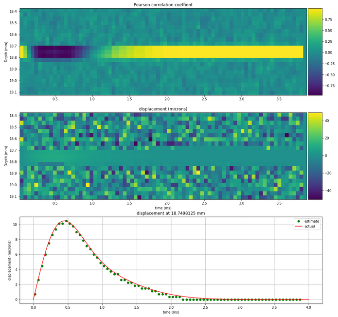

# disp-track-1d
Demonstration of 1-D displacement tracking in ultrasound using a single target and normalized cross correlation (NCC)

This is a basic demonstration of 1-D displacement tracking using the conventional cross correlation method. A single target is represented by a gaussian pulse, and multiple, shifted-versions of that pulse are generated to mimic the displacement arising from a user-specified displacement curve. The present curve is ARF-like.

The idea is just to explore the process and and see how various parameters affect the outcome. For this purpose I've incorported bit-depth of the signals, daq vertical range, SNR, jitter, etc. 

Dependencies include scipy, numpy, matplotlib - i.e. the conda root environment should work just fine.

